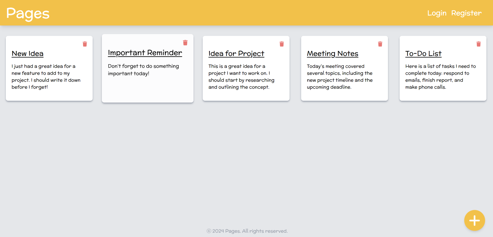
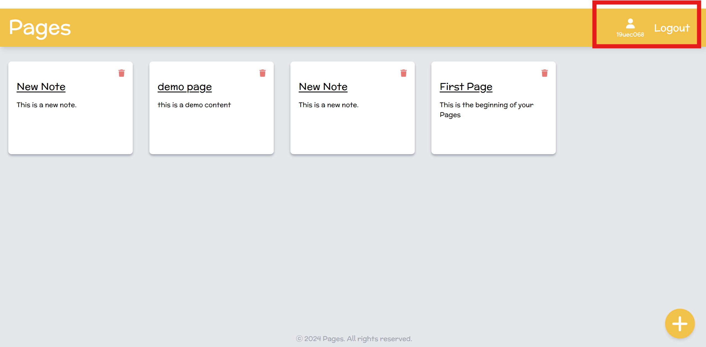
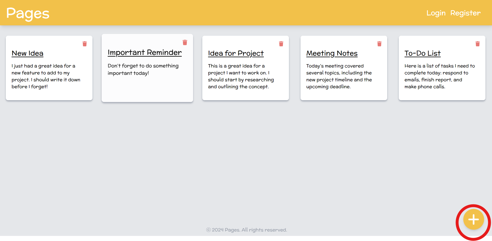
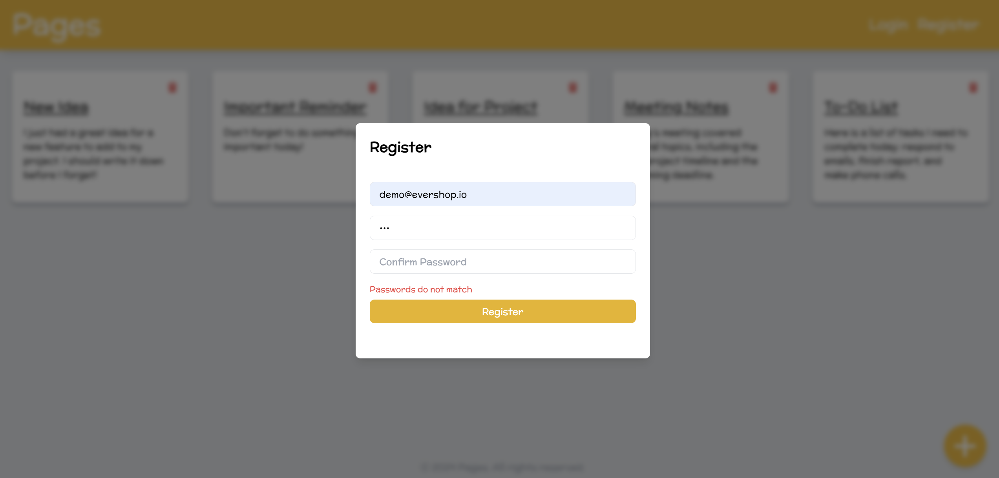
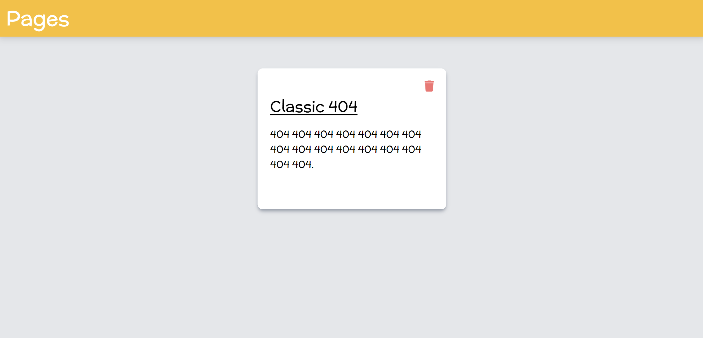
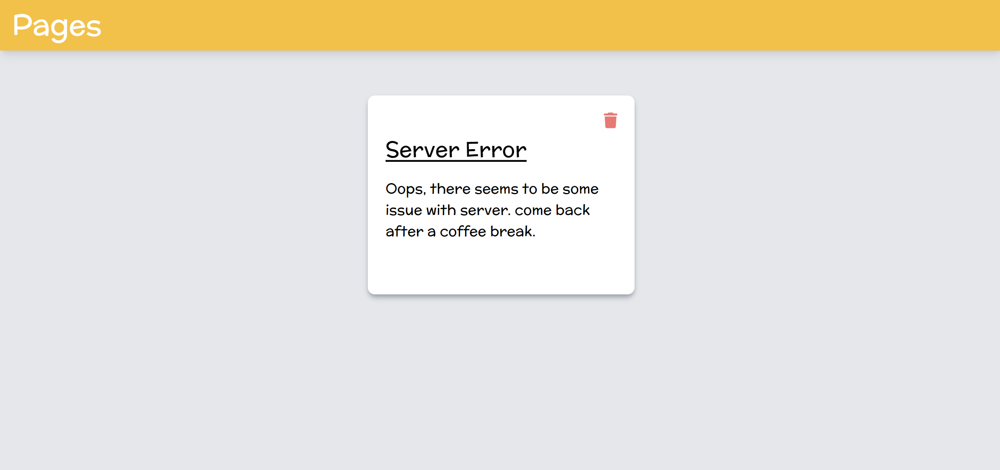
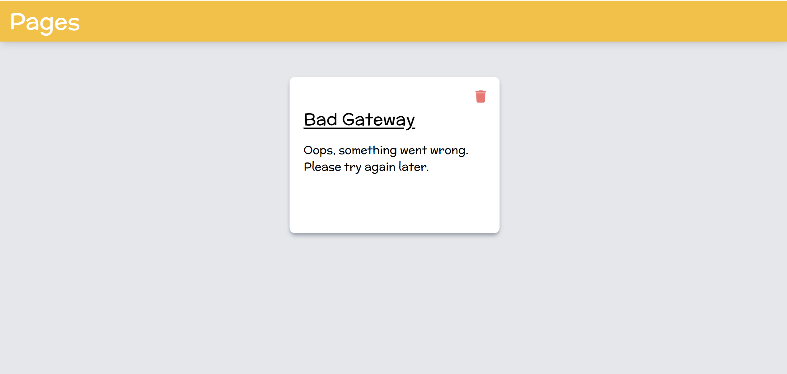

# Pages - A Simple and Secure Notes Keeping Website

Welcome to Pages! This is a web application designed to help you keep track of your notes securely and efficiently. You can use Pages without logging in, but be aware that any notes created as a guest will be lost if the page is reloaded. [Link to demo](https://super-tartufo-03f63d.netlify.app/)

## Features

 

- **Guest Access**: Create and manage notes without logging in. However, notes will be lost upon reload.
  
- **User Registration & Login**: Register for an account to save your notes securely. Your password is protected by hashing, ensuring that it is never stored in plaintext. You will see the username and Logout button on top right when logged in.
  
- **CRUD Operations**: Pages supports all basic operations—Create, Read, Update, and Delete notes. Changes are reflected immediately across the UI.
- **Responsive Design**: The frontend is built with Tailwind CSS and React, ensuring a modern and responsive user experience.
- **Security**: No cookies are saved to protect user data, meaning you'll need to log in again if the page is reloaded.

## Technologies Used

- **Frontend**: Tailwind CSS, FontAwesome Icons, React
- **Backend**: Node.js (JavaScript), Django (Python), Spring Boot (Java)
- **Database**: PostgreSQL for managing relational data

## API Endpoints

### Authentication

 

- **POST `/login`**: Authenticates a user with their credentials.
  
- **POST `/register`**: Registers a new user and automatically logs them in.

### Notes Management

- **GET `/notes`**: Retrieves all notes for the logged-in user.
- **POST `/addnote`**: Adds a new note to the user's account.
- **DELETE `/deletenote`**: Deletes a note based on its ID.
- **PATCH `/updatetitle`**: Updates the title of an existing note.
- **PATCH `/updatecontent`**: Updates the content of an existing note.

### Error Handling

 

- **GET `/404`**: Displays a custom 404 Not Found page.
  
- **GET `/server-error`**: Displays a custom 500 Internal Server Error page.
  
- **GET `/badgateway`**: Displays a custom 502 Bad Gateway page.

## Getting Started

To set up the project locally, follow these steps:
**PostgreSQL is needed for backend**

## Frontend

1. **Clone the repository**:`git clone https://github.com/pranav9012/Projects.git`
2. **Navigate to the Pages directory under Frontend**:`cd Frontend/Pages`
3. **Install dependencies**:For the frontend:

   ```bash
   npm install

   ```
4. **Run Frontend**

   ```bash
   npx vite

   ```

## Backend

1. **Clone the repository**:
   `git clone https://github.com/pranav9012/Projects.git`
2. **Navigate to the Pages directory under your preferred language stack**:

### NodeJS

1. `cd NodeJS/Pages`
2. **Install dependencies**:

   ```bash
   npm install

   ```
3. **Run Node**

   ```bash
   node index.js

   ```

### Django

1. `cd Python/Pages`
2. **Install dependencies**:

   ```bash
   pip install -r requirements.txt

   ```
3. **Run Django**

   ```bash
   python manage.py makemigrations
   python manage.py migrate
   python manage.py runserver 3000

   ```

### Spring-boot

1. `cd Spring/Pages`
2. **Install dependencies**:

   ```bash
   ./mvnw install

   ```
3. **Run Spring boot**

   ```bash
   ./mvnw spring-boot:run
   ```
