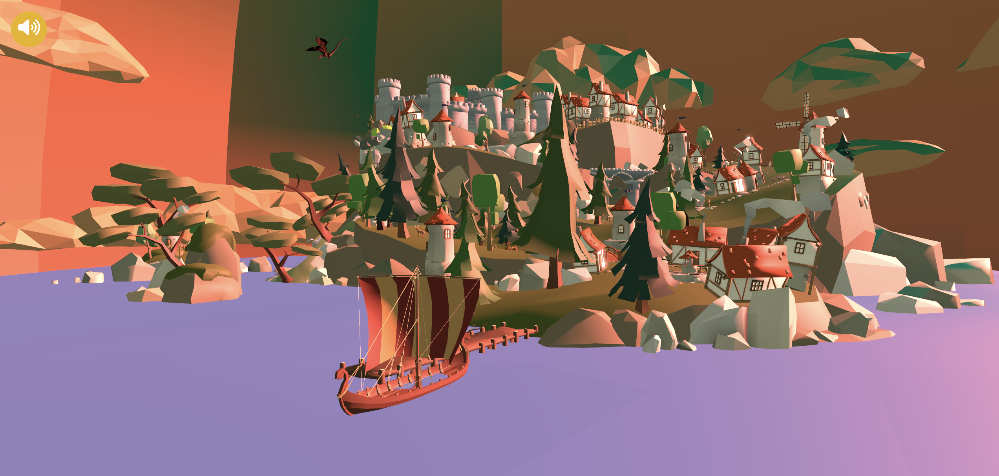

# 3D Interactive Portfolio

This Folder contains the code for my **3D Interactive Portfolio**, a web-based experience that showcases my projects, skills, and creative work in an engaging, immersive way. Built using **React**, **Three.js**, and **Framer Motion**, this portfolio provides users with interactive 3D elements, smooth animations, background music, and a custom preloader to manage the loading of assets efficiently.
 

## 🚀 Live Demo
Explore the portfolio live at: [Pranav's Theatre](https://heroic-hummingbird-83f3cd.netlify.app/)

## Features

### 🎨 Immersive 3D Interactions
- **Three.js** is used to create real-time, interactive 3D scenes.
- Users can interact with 3D models and navigate between sections of the portfolio with smooth transitions.
- The portfolio features clickable 3D objects that present details about each project.

### 🕹️ Responsive User Interactions
- Developed with **React Three Fiber**, allowing for dynamic 3D rendering within a React environment.
- Each interaction is optimized for responsiveness across different screen sizes and devices, ensuring smooth transitions and animations on both desktop and mobile.

### 🎶 Background Music
- Ambient background music adds to the immersive experience. The music complements the visual environment, creating a holistic experience for users.
- Music playback can be easily muted or adjusted via on-screen controls for user convenience.

### ⏳ Custom Loading Screen
- To improve user experience, a **custom loading screen** was implemented to manage asset loading.
- As the 3D assets load, a progress indicator provides real-time feedback, ensuring users know when the site is ready.
- Once all assets are fully loaded, users are seamlessly transitioned into the main interface.

### ⚡ Smooth Animations
- **Framer Motion** is used for beautiful, smooth animations across the entire portfolio.
- This includes transitions between sections, model animations, and hover effects to guide user attention and enhance interaction.
- Animations are fine-tuned for a polished, professional feel, adding depth to the experience.

### 🌐 Project Sections
- The portfolio showcases my professional projects and personal work through interactive 3D models.
- Each project section features a detailed breakdown, including tech stacks, key achievements, and links to repositories or live demos.

### 💻 Technology Stack
- **React.js**: The frontend library for building the user interface.
- **Three.js**: For rendering 3D graphics in the browser.
- **React Three Fiber**: A React renderer for Three.js, enabling declarative code for 3D scenes.
- **React-three/drei**: A helper library for common Three.js utilities, simplifying 3D development.
- **Framer Motion**: Handles animation and transitions for a more fluid and dynamic experience.
- **Theatre.js**: Used for animating and synchronizing keyframes, enhancing the 3D animations with precise timing and motion control.
- **SCSS / Tailwind CSS**: For styling and layout.
- **Vite**: For fast, efficient builds and development environment.

## 💡 Key Learnings
During the development of this project, I learned how to integrate complex 3D models with user interactions and how to handle asset management efficiently. I also gained hands-on experience in creating seamless animations and transitions, further improving my frontend development skills, especially in crafting immersive user experiences.

## 🛠️ Installation and Setup

1. **Clone the repository**: `git clone https://github.com/pranav9012/Projects.git`
2. **Navigate to the Pages directory under Frontend**: `cd Frontend/Portfolio`
3. **Install dependencies**:
   ```bash
   npm install
   ```
4. **Run Frontend**

   ```bash
   npx vite /  npm run dev
   ```
