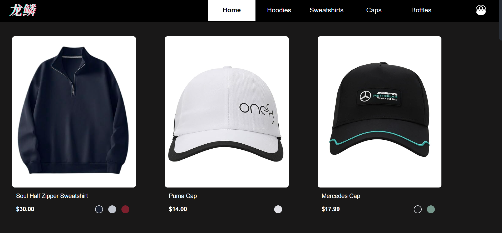
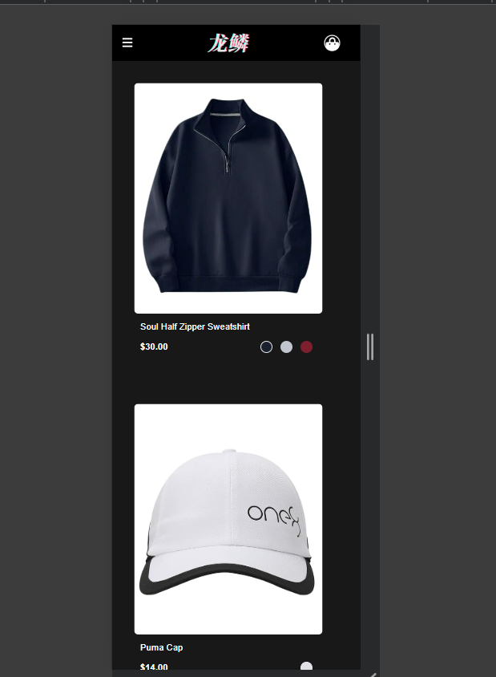
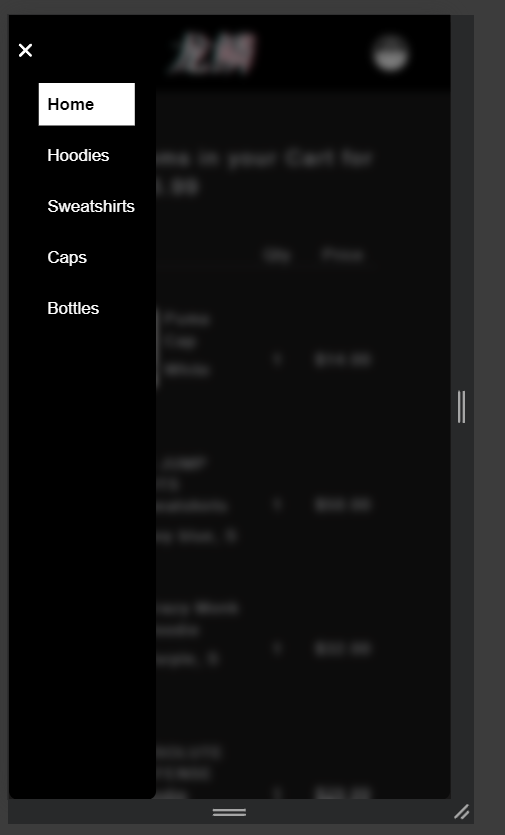
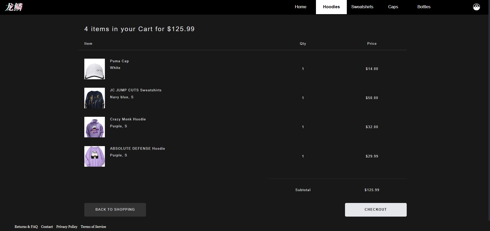
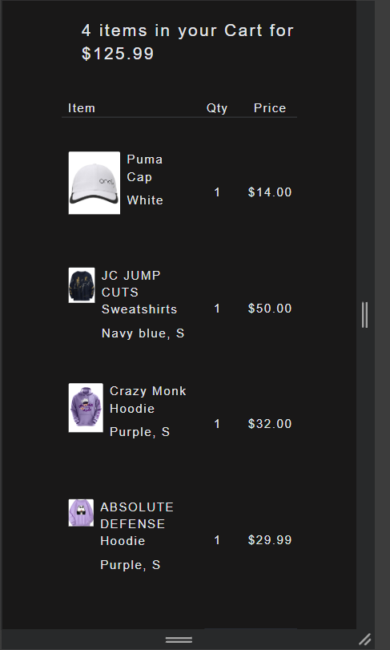
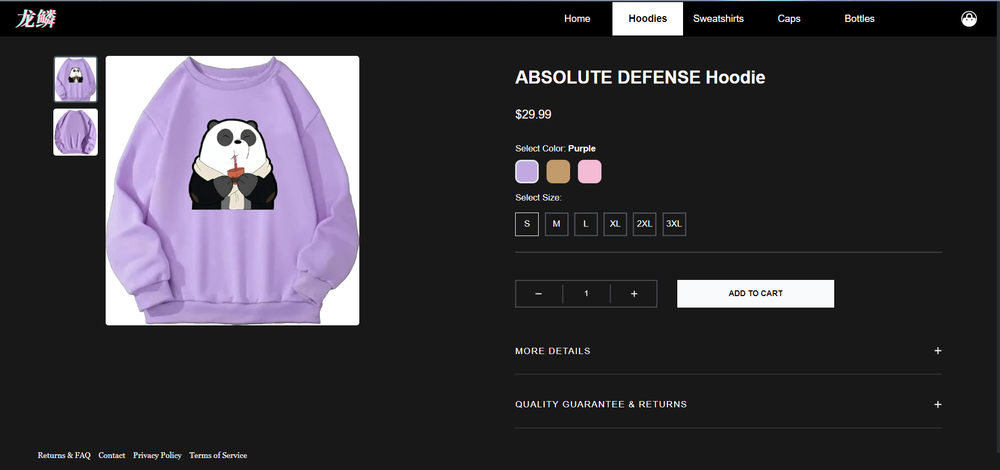
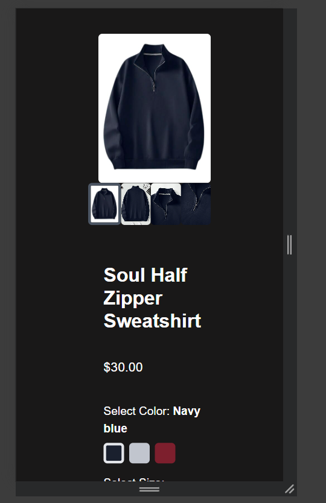

# eCommerce Website - A Modern Shopping Experience

Welcome to our eCommerce website! This platform provides a seamless shopping experience with a variety of features to enhance user interaction and convenience. [Link to demo](https://resonant-parfait-692825.netlify.app/)

## Features



- **Home Page**: A welcoming landing page that showcases our top products and categories.
  
  
- **Dynamic Navbar**: The navigation bar allows users to browse specific types of products. On mobile devices, the navbar transforms into a hamburger menu for a cleaner and more accessible interface.

  
- **Cart Functionality**:
  

  - **New Item Indicator**: A red dot appears on the cart icon when a new item is added, disappearing once the cart is opened.
    
  - **Persistent Cart Items**: Cart items are stored in a session, ensuring they remain until the browser is closed.



- **Product Pages with Dynamic URLs**: Each product has its own page with a unique URL in the format `localhost/store/title`. Product data, including images, is dynamically fetched from the database.
  
- **Additional Pages**:

  - **Returns**: Information on how to return purchased items.
  - **Contact Us**: A page to reach out to customer service.
  - **Privacy Policy**: Details on how customer data is handled.
  - **Terms of Service**: The rules and regulations for using our website.

## Technologies Used

- **Frontend**: Tailwind CSS, FontAwesome Icons, React
- **Backend**: Node.js (JavaScript), Django (Python), Spring Boot (Java)
- **Database**: PostgreSQL for managing relational data

All product images and data are stored in a database and fetched dynamically when a product page loads.

## Mobile-Friendly Design

The website is designed to be fully responsive. On mobile devices:

- The navigation bar collapses into a hamburger menu for easier access.
- All pages and features are optimized for mobile screens.

## Getting Started

To set up the project locally, follow these steps:
**PostgreSQL is needed for backend**

## Frontend

1. **Clone the repository**:`git clone https://github.com/pranav9012/Projects.git`
2. **Navigate to the Pages directory under Frontend**:`cd Frontend/Store`
3. **Install dependencies**:For the frontend:

   ```bash
   npm install

   ```
4. **Run Frontend**

   ```bash
   npx vite

   ```

## Backend

1. **Clone the repository**:
   `git clone https://github.com/pranav9012/Projects.git`
2. **Navigate to the Pages directory under your preferred language stack**:

### NodeJS

1. `cd NodeJS/Store`
2. **Install dependencies**:

   ```bash
   npm install

   ```
3. **Run Node**

   ```bash
   node index.js

   ```

### Django

1. `cd Python/store`
2. **Install dependencies**:

   ```bash
   pip install -r requirements.txt

   ```
3. **Run Django**

   ```bash
   python manage.py makemigrations
   python manage.py migrate
   python manage.py runserver 3000

   ```

### Spring-boot

1. `cd Spring/store`
2. **Install dependencies**:

   ```bash
   ./mvnw install

   ```
3. **Run Spring boot**

   ```bash
   ./mvnw spring-boot:run
   ```
