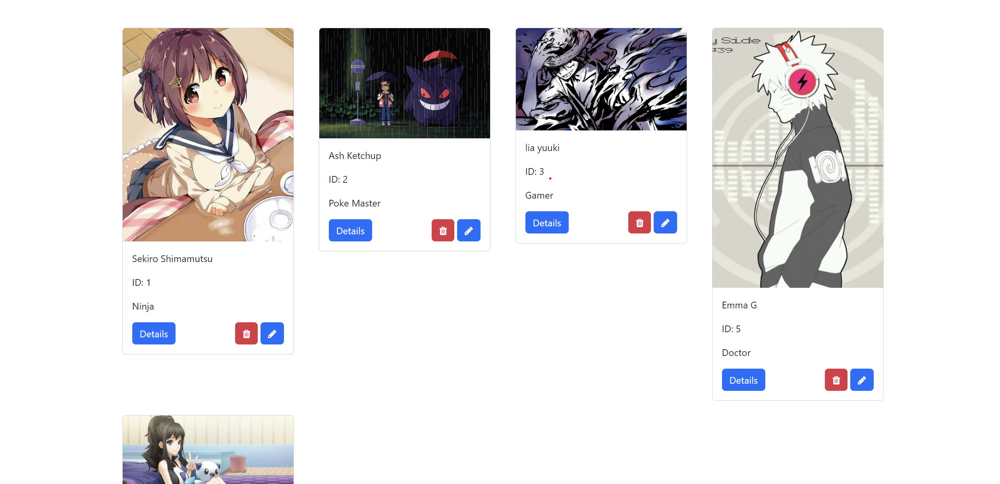
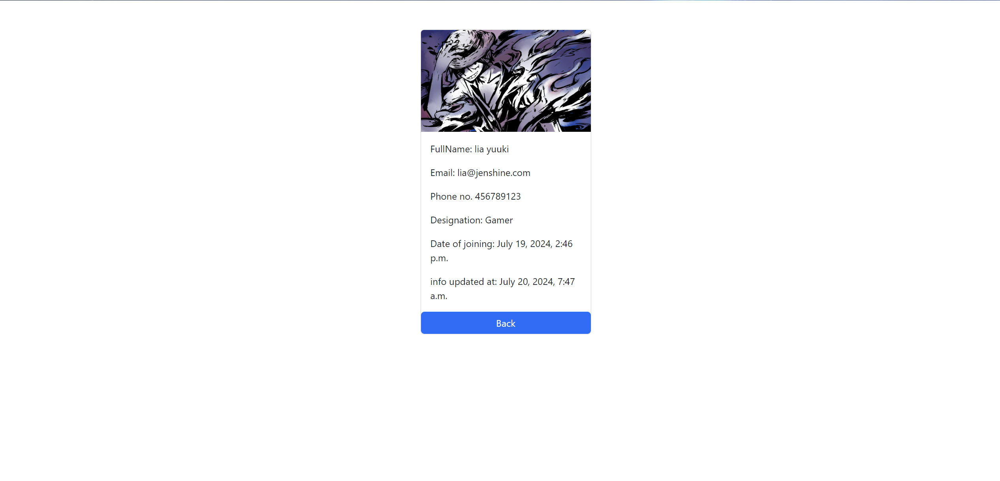
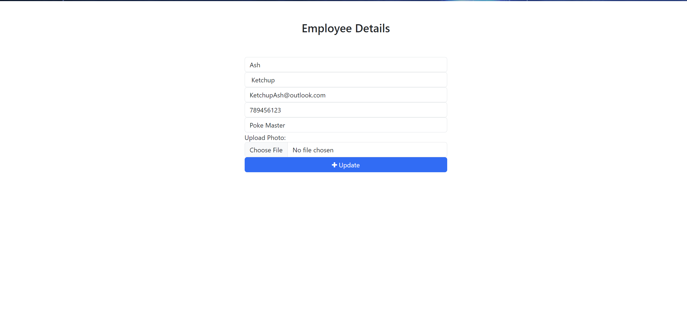
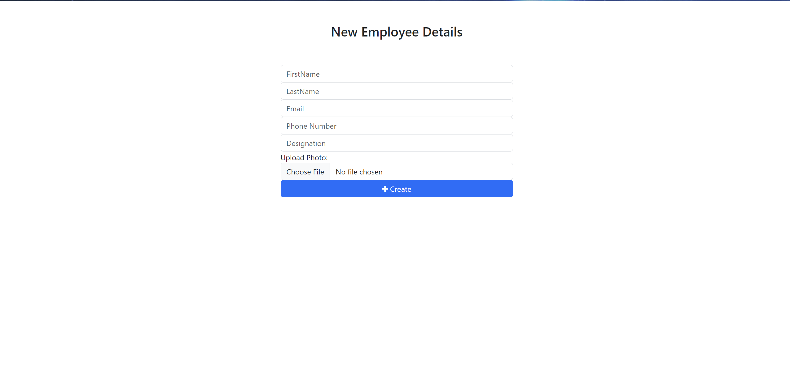

# Employee Directory/Management System

This is an Employee Directory/Management System built with Django for the backend and HTML, CSS, and Bootstrap for the frontend. SQLite is used as the RDBMS.

## Features

### Homepage
- The homepage displays a list of current employees with their photo and essential details like Name, Email, and Designation.

### Employee Card
Each employee is represented by a card featuring three buttons:
- **Details**: Shows the selected employee's full details.

- **Trash Can**: Deletes the employee from the directory.
- **Pencil**: Allows editing the employee's details.

### Add Employee
- At the end of the homepage, there is an "Add Employee" button. This opens a form to input the new employee's first name, last name, email, phone number, designation, and a photo.

## How to Use
1. **Add an Employee**: Click the "Add Employee" button and fill in the form.
2. **View Details**: Click the "Details" button on an employee card to view more information.
3. **Edit an Employee**: Click the "Pencil" icon to modify an employee's information.
4. **Delete an Employee**: Click the "Trash Can" icon to remove an employee.

## Installation
1. Clone the repository.
2. Install dependencies with `pip install -r requirements.txt`.
3. Run migrations with `python manage.py migrate`.
4. Start the server with `python manage.py runserver`.

## License
This project is licensed under the MIT License.

